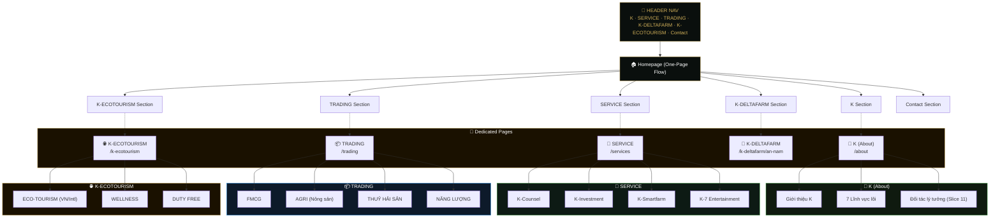

# 🗺️ Sitemap — K Service Trading (Visual)

---

## 📋 Navigation Map & URLs

| Menu Item | URL | Key Content |
|-----------|-----|-------------|
| **K** | `/about` | Intro, 7 Core Sectors, Investor Partner (Slice 11) |
| **SERVICE** | `/services` | Counsel, Investment, Smartfarm, Entertainment |
| **TRADING** | `/trading` | FMCG, Agri, Seafood, Energy |
| **K-DELTAFARM** | `/k-deltafarm/an-nam` | Project AN NAM (Ecofarm & Wellness) |
| **K-ECOTOURISM**| `/k-ecotourism` | Eco-Tourism (VN/Intl), Wellness, Duty Free |
| **Contact** | `#contact` | Lead Form, Office Info |

---

## 🔗 Interaction Flow
1.  **Homepage** serves as the primary landing hub, summarizing all sectors.
2.  **Dedicated Pages** provide deep-dives into each business unit with specific call-to-actions.
3.  **Cross-linking**: "Trading" and "Service" sections on the homepage link to their respective dedicated pages.
4.  **Conversion**: All pages funnel users toward the **Contact** section/form.
